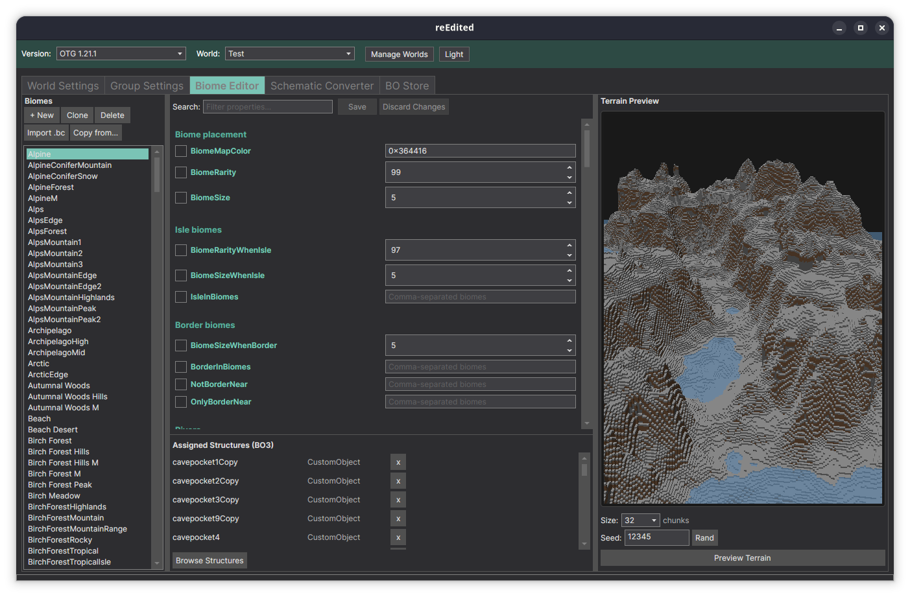
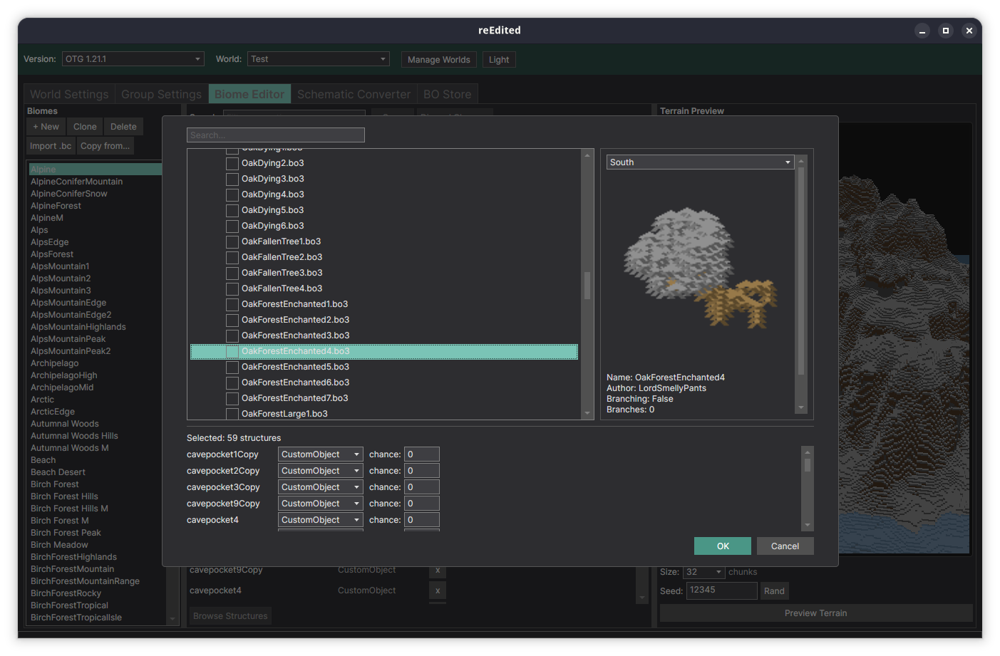
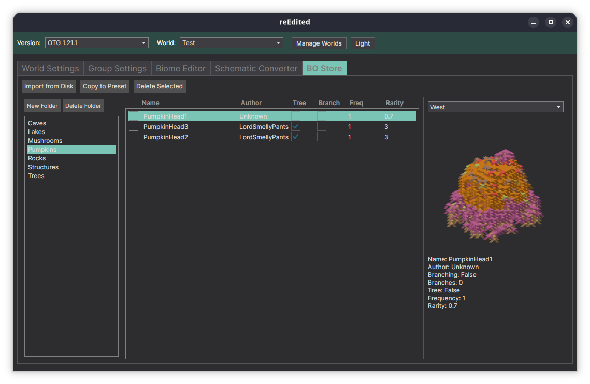
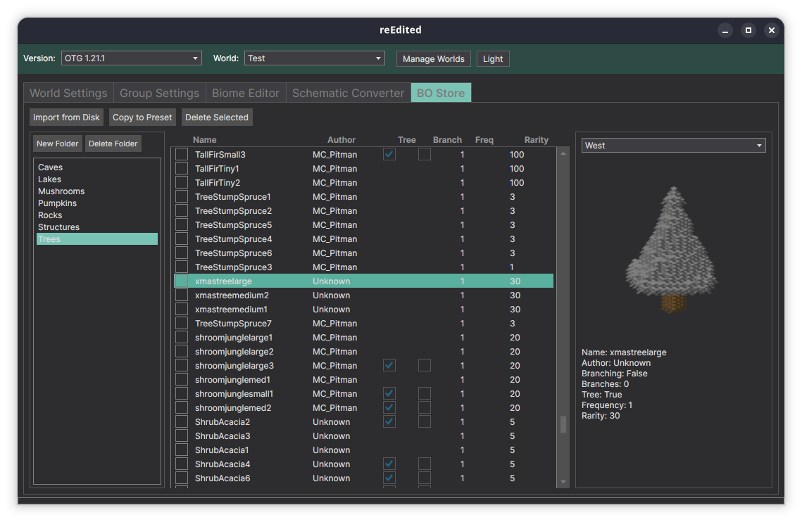

# Creating a Preset

!!! note "Work in Progress"
    This page is under construction.

## OTGEdit (reEdited)

A visual editor for OTG presets is being ported to .NET 10 and [Avalonia UI](https://avaloniaui.net/) — cross-platform (Windows, Linux, macOS) with a modern dark UI.

Features include:

- **World Settings** — edit DimensionPresetConfig.ini with live 3D terrain preview
- **Biome Editor** — configure biome settings visually
- **Schematic Converter** — convert and preview BO3/BO4 objects with 3D rendering
- **BO Store** — browse, import, and manage custom objects with 3D previews

